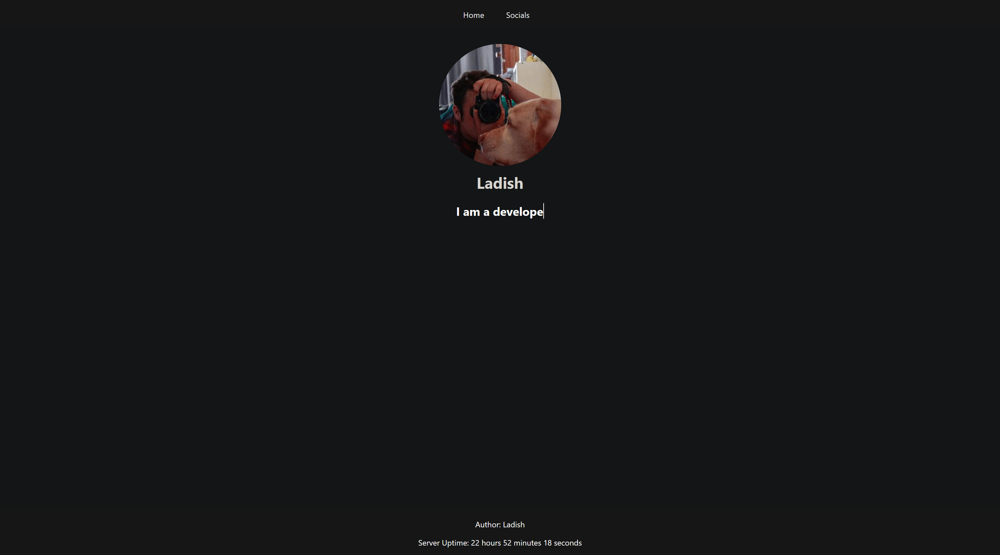

# Personal-Website

## My Personal Site
My site that has info all about me and what I have done and been up to. 

## Description
This project is to enable me to have a website that I can periodically update with everything im up to. It will also include data such as my socials, projects and what I am currently up to.

## Visuals
Currenly my site consists of 2 pages being home and socials in a very basic form. Im planning to add more to these pages and make it much more appealing to the users that access this site

## Installation
For this project my site is running on an Oracle EC2 Server at the current moment. I am using Apache2 to run this web server and allow users to access it. It is fully secure using Lets Encrypt for a free ssl.

## Usage
Currently being used to host info about me and what I have been up to and could be repurposed for other things later.

## Roadmap
If you have ideas for releases in the future, it is a good idea to list them in the README.
Coming up I am planning to develop the site to be better and more usable such on smaller screens and also make everything look nicer. I have a bunch more information I want to implement into the site to make it better and full of info. I am also gonna make good use of flex boxes and grids within my page to neatly organise everything.

## Contributing
Any contributions to my website on how to improve it or make it better would be greatly appricated.

## Project status
Currently Undergoing Improvements and getting the site setup for public access.