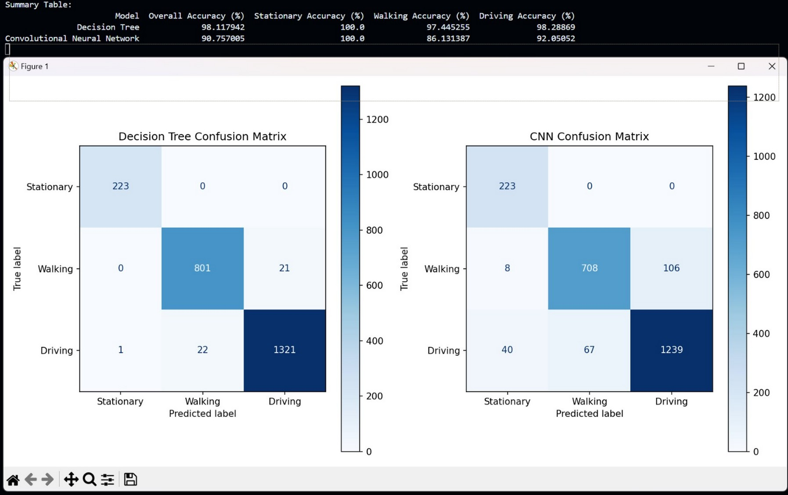

import ExternalLink from '../../components/ExternalLink.astro';

## Introduction  

For this project I collected a range of GPS data across different modes of transport, including **stationary, walking, and driving**. The dataset contained latitude, longitude, elevation, speed, and a labelled transport method.  

The goal was to process this dataset using Machine Learning models to **classify transport modes based on GPS data**. By analysing location and speed, I evaluated how effectively ML could determine patterns of movement, while also reflecting on IoT privacy and security implications.  
 
## Developing Machine Learning Models  

Two models were selected and trained on the dataset:  

### Decision Tree (DT) Model  
The DT model was chosen for its interpretability and effectiveness with structured data. It recursively splits the dataset into subsets based on threshold values — a process of *splitting, stopping, and pruning*.  

- **Strengths:** Easy to interpret, handles structured GPS data well.  
- **Weaknesses:** Results varied slightly across runs, as splits were random. With more tuning (e.g., fixed splitting strategies), results could be stabilised.  

### Convolutional Neural Network (CNN) Model  
Although CNNs are commonly used for image data, this model was applied to structured GPS features (latitude, longitude, speed, elevation).  

- Used **sigmoid activation** to capture nonlinear relationships.  
- Output layer used **softmax** with three neurons (one per transport method).  
- Training utilised the **Adam optimizer** over **35 epochs** for improved accuracy.  

## Data Results  

The performance of both models was measured using accuracy scores and confusion matrices.  

  

| Model            | Overall Accuracy | Stationary | Walking  | Driving  |
|------------------|------------------|------------|----------|----------|
| **Decision Tree**| **98.1%**        | 100%       | 97.4%    | 98.3%    |
| **CNN**          | **90.8%*         | 100%       | 86.1%    | 92.0%    |

The DT model outperformed the CNN, particularly for **walking detection**, where the CNN misclassified many samples as *driving*.  

## Societal Implications of IoT & GPS Data  

### Benefits  
- **Smart cities:** Optimised traffic flow, public transport, and safety through aggregated GPS data.  
- **Industry & automation:** Data-driven efficiency improvements in logistics, operations, and consumer applications.  

### Privacy & Ethical Concerns  
IoT and GPS data collection introduces risks such as:  
- Unauthorised access or profiling of individuals.  
- Data misuse by organisations without user consent.  
- Weak authentication or insecure device firmware (common in IoT).  

Mitigations include strong encryption, regular firmware updates, secure authentication, and transparent user consent mechanisms.  

## Conclusion  

This project demonstrated how **Machine Learning can classify transport modes using GPS data**.  

- The **Decision Tree** achieved higher overall accuracy and consistency.  
- The **CNN** underperformed, especially for walking, but could improve with larger datasets or additional features (e.g., accelerometer data).  

Beyond technical results, the study also highlighted the **dual nature of IoT systems**: while they enable efficiency and innovation, they also raise critical **privacy and security challenges**.  

Future directions include:  
- Expanding datasets across more transport types.  
- Applying real-time ML models for live classification.  
- Embedding stronger privacy and security safeguards in IoT deployments.  
