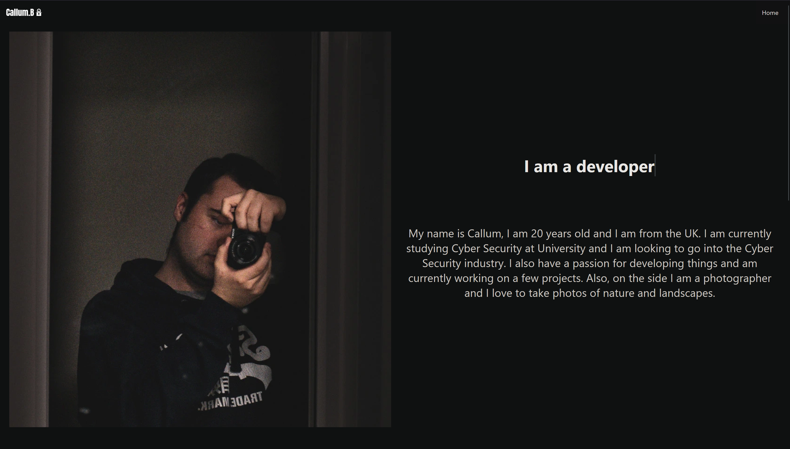
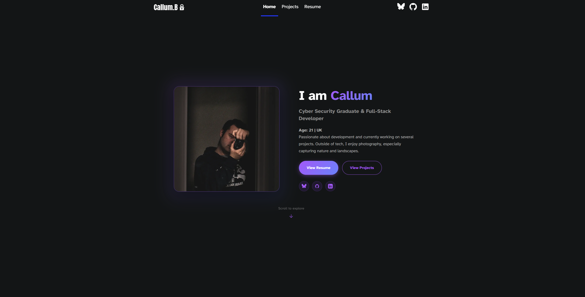

import ExternalLink from '../../components/ExternalLink.astro';

Open Repo: https://github.com/LadishDev/Personal-Website

Originally Designed and Developed from the 6th December 2023 my previous site that was used looked like the following.

It was a simple single page site that had all information about me. But, with this putting all the information in one place made the site felt cramped and limiting. It also made it hard to read with so much text being squished in one after the other in mutiple grid and flexboxes one after each other.

However, On July 20th 2025 I started to redesign the site using Astro.

I decided to undertake this project due to my old site feeling cramped with it all on a single compact page. I also wanted to have a place where I could present the projects and work that I have contributed towards.

This project also enabled me to have a chance with new technologies in the field as my old site was just plain HTML/CSS and I had now restarted from scratch and decided to pick and focus on Astro due to it having reduced loading times and good SEO and it also enabled me to easily deploy my projects pages and get started.